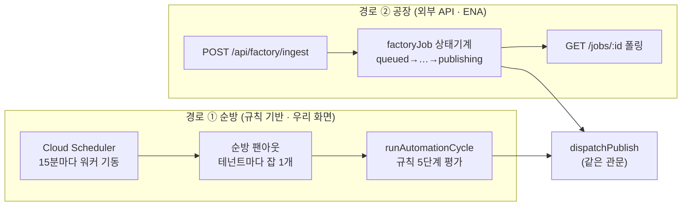

# 자동배포가 멈추는 경우 전수 — 무엇이 일어나고, 사용자는 어떻게 알고, 어떻게 다시 시키나

> 2026-08-17 작성 · 2026-08-18 갱신. `automation.ts` · `automation-cycle.ts` · `factory.ts` ·
> `credits.ts` · `auto-topup.ts` · `content-pipeline.ts` 를 읽어 **실제 코드 동작**으로 채웠다.
> 추정은 "미확인" 으로 표시했다.
>
> 숫자·임계값의 정본은 **§6 표**다 — `docs-drift.test.ts` 가 코드 상수와 대조하므로,
> 코드를 바꾸면 그 표가 먼저 깨진다(본문의 숫자도 같이 고칠 것).
>
> 왜 이 문서인가: 자동배포의 실패는 **조용한 정지**로 나타난다. 규칙은 "실행 중" 인데
> 아무것도 안 나가는 상태가 이 리포의 최빈 실패모드다. 그래서 "무엇이 멈추나" 보다
> **"사용자가 그걸 어떻게 알게 되나"** 를 같은 표에 나란히 둔다.

---

## 0. 자동배포는 두 개의 다른 경로다

두 경로는 **게시 관문은 공유**하지만 **알림 방식이 완전히 다르다.**
순방은 화면(실행 로그·배너)으로 말하고, 공장은 **응답과 폴링으로만** 말한다.
공장 경로에는 웹훅·콜백이 없다(2026-08-17 확인).

---

## 1. 돈이 바닥날 때 — 정지 지점 6개

크레딧은 **분석에만 든다.** 게시·렌더는 크레딧을 소모하지 않는다. 그런데 아래 6번 때문에
잔액이 0 이면 **이미 값을 치른 클립의 게시까지 멈춘다.**

| # | 언제 | 지금 동작 | 사용자가 아는 방법 | 어떻게 다시 도나 |
|---|---|---|---|---|
| 1 | 공장 접수 (`/api/factory/ingest`) | 잔액 ≤ 0 이면 **402 즉시 거절** | API 응답 `insufficient_credits` | 충전 후 **호출자가 다시 호출**(ENA 몫) |
| 2 | 업로드·from-youtube 접수 | 업로드는 성공, **분석만 보류** | 회차 화면 ⚠ `blockedReason` "크레딧 부족 — 충전 후 분석을 시작하세요" | 🔴 **사람이 분석을 다시 눌러야 한다** — 충전해도 자동 재개 없음 |
| 3 | 공장이 분석 태우기 직전(길이 기반 정밀 판정) | 잡 `failed` · "크레딧 부족 — N개 모자랍니다" | `GET /api/factory/jobs/:id` 폴링 | `POST /api/factory/jobs/:id/retry` |
| 4 | 분석이 도는 중에 소진 | **끝까지 돈다.** 차감으로 잔액이 음수로 갈 수 있다(의도 — 원가는 이미 나갔다) | 잔액 표시 | — |
| 5 | 차감 직후 자동충전 | 정책이 켜져 있으면 저장카드로 자동 결제. 상한 3중(일 **시도** 횟수·월 금액·절대상한) | 성공은 원장 행으로 보인다. ✅ **조치가 필요한 실패는 경고 한 건으로 남는다** (2026-08-18 · 아래 상자) | 카드 교체·상한 조정·직접 충전 1회 → 그 자리에서 경고 해제, 다음 분석 완료 때 재시도 |
| 6 | 다음 순방 시작 | 잔액 ≤ 0 이면 **순방 전체 정지**(채택도 게시도 안 함) | 자동배포 화면 배너 `idleReason` = "크레딧 부족 — 충전 필요" | 충전 → **다음 순방(15분)에 자동 재개** |

**6번의 부작용**

- ✅ **실행 로그에도 남는다** (2026-08-18). 배너(`idleReason`)는 "지금 상태" 라서 지나간
  시간을 설명하지 못한다 — 그래서 `CREDIT_STOP_NOTE` 를 **워크스페이스 단위 한 줄**로
  남긴다(`rule_id` 없음 · KST 하루 1줄). 규칙별 패널이 아니라 전체 기록 목록에 뜬다.
- 🔴 **게시까지 멈춘다.** 렌더까지 끝난 클립(=이미 크레딧을 쓴 결과물)이 잔액 0 때문에
  배달되지 않는다. 크레딧은 분석 비용인데 게시가 인질이 되는 구조다.

**자동 충전 경고 (5번 · 2026-08-18)** — 실패가 서버 로그 한 줄로 끝나던 자리.

| 축 | 지금 동작 |
|---|---|
| 무엇이 경고가 되나 | 사유 코드의 심각도가 **조치 필요**인 **8개**뿐 — 카드 해지 · 카드 구매자 정보 없음 · 충전량 오류 · **결제 단가 미설정** · 충전량이 임계 이하 · 오늘 횟수 상한 · 이번 달 금액 상한 · 카드사 거절. 하나는 사용자가 못 고친다(단가 미설정 = 서비스 쪽 설정) — 그래서 문구가 "담당자에게 문의" 로 갈린다 |
| 무엇이 경고가 아닌가 | 자동 충전 꺼짐 · 잔액이 임계보다 많음 · 미정산분 정산됨 · 카드 미등록 · 결제 확인 보류. 사용자가 지금 할 일이 없는 사실이다 — 정상을 매번 띄우면 경고가 배경음이 되어 진짜 경고를 가린다 |
| 어디로 보이나 | 워크스페이스당 **한 건**(쌓지 않고 갱신 · 처음 실패한 시각은 보존해 "언제부터" 를 남긴다). 자동배포 응답에서는 "크레딧 부족" 배너 **옆에**, 결제 응답에서는 실제로 조치하는 자리에 같은 값이 온다 |
| 언제 사라지나 | ① 사용자가 조치한 자리에서 즉시(카드 재등록 · 자동 충전 설정 저장 · 직접 충전 성공) ② 다음 판정이 정상이면 ③ **상한 경고는 기간이 지나면 저절로** — "오늘 …" 은 날짜(KST)가, "이번 달 …" 은 달이 바뀌면 읽는 쪽에서 만료로 본다 |

③이 핵심이다. 경고를 지우는 유일한 경로가 "다음 자동 충전 판정" 인데 그 판정은 분석이
끝날 때만 돈다 — 잔액 0 으로 분석이 멈춘 워크스페이스는 판정이 영영 안 와서 **사흘 전
기록이 오늘 걸린 것처럼** 남았다. 그래서 만료 판정을 쓰는 쪽에 뒀다.

🔴 남은 한계: 화면은 아직 이 값을 읽지 않는다(프론트 개편 중) — 응답까지만 도달했다.
`clip.autoRender` 와 같은 상태다(§2 상자).

---

## 2. 영상 소스가 없을 때 — 상황이 5가지로 갈린다

"소스가 없다" 는 한 가지가 아니다. 2026-08-18 이전에는 넷이 **완전히 조용했고**, 하나는
**거짓 희망을 줬다.** 지금은 다섯 다 말을 한다.

| # | 상황 | 지금 동작 | 사용자가 아는 방법 |
|---|---|---|---|
| 1 | 규칙의 프로그램에 회차가 아예 없다 | 평가만 하고 넘어감 | ✅ 실행 로그 `no_episode` — "이 규칙의 프로그램에 회차가 없습니다…" |
| 2 | 회차는 있는데 **채택할 추천이 없다**(전부 채택·거절됨) | 후보 0건 | ✅ `no_pending` · 클립이 이미 다 나갔으면 `all_sent` |
| 3 | 구간이 기존 클립과 겹쳐 전부 제외됨(재분석 후) | 후보 0건 | ✅ `overlap` — "중복 배포를 막는 정상 동작입니다" |
| 4 | top3 상한(회차당 3건) 도달 | 후보 0건 | ✅ `top3_cap` (하루 할당량과 다른 축임을 문구가 말한다) |
| 5 | 소스 파일이 사라짐(GCS 삭제·경로 변경) | 공장: `failed` "미디어가 사라졌다" 순방: 렌더 재요청 → **3회 또는 30분이면 확정 실패** | ✅ 실행 로그 `failed` — "렌더가 N회 실패해 자동 게시를 멈춥니다…" 공장은 폴링으로 알 수 있다 |

**규칙별 유휴 사유(`ruleIdleNote`) — 규칙 하나가 아무 일도 안 했을 때 딱 한 줄**

사유는 **22개**(`RULE_IDLE_CODES`)이고 그중 **하나만** 고른다. 여럿을 늘어놓으면 어디부터
손대야 할지 알 수 없다. 고르는 순서에 근거가 있다 — 순서가 흔들리면 같은 상황에서 로그가
매번 다른 말을 한다.

| 순서 | 무리 | 사유 코드 | 왜 이 자리인가 |
|---|---|---|---|
| ⓪ | 시간창 밖 · 요일 아님 | `off_hours` → `off_day` | 규칙 평가 자체를 안 했다 — 다른 사유를 말할 근거가 없다. 발행 요일(2026-08-20)도 같은 자리다: 토요일에 "왜 안 나갔지" 를 볼 때 설정 때문인지 고장인지 구분할 근거가 로그에 있어야 한다 |
| ① | 일을 했음 | (사유 없음) | 이번 순방에 하나라도 채택했으면 유휴가 아니다 |
| ② | 상류가 비었음 | `no_episode` | 회차가 없으면 하류 사유는 존재할 수가 없다 |
| ③ | 분석 완료 0 | `analysis_blocked` → `analysis_failed` → `analyzing` | **분석 끝난 회차가 하나도 없으면 하류 사유는 전부 공허하다.** 안에서도 **큐잉조차 안 된 것**(blocked)이 먼저다 — 기다리면 끝나는 것(analyzing)과 섞으면 영원히 안 오는 완료를 기다리게 된다 |
| ④ | 게시 단계 · 사람 손 | `render_stopped` → `gate_off` → `publish_failed` → `held_waiting` → `vague_account` → `channel_rule` → `quota_done` | **이미 만든 클립이 못 나가고 있는데** "채택할 추천이 없습니다" 라고 말하면 정반대를 보게 된다 |
| ⑤ | 규칙을 바꾸면 풀림 | `top3_cap` → `score_blocked` → `kind_mismatch` → `too_long` → `overlap` | 사람이 설정으로 해결할 수 있는 것. `too_long`(숏폼 90초 상한 초과 · 2026-08-25)이 `overlap` 보다 앞인 이유는 겹침은 **정상 동작**이고 이건 조치가 필요해서다 — 재분석하면 상한 안으로 다시 뽑히고, 긴 구간 그대로 낼 거면 방향을 가로형으로 바꾼다 |
| ⑥ | 시간이 풀어 줌 | `render_waiting` → `meta_waiting` | 가만두면 끝난다 — 사람 몫보다 뒤에 두는 게 이 순서의 근거다 |
| ⑦ | 정상 정지 · 기본값 | `all_sent` → `no_pending` | 마지막 |

③이 없으면 "채택할 새 추천이 없습니다" 라는 **틀린 사유**가 나간다 — 진짜 원인은 분석
실패인데 사용자는 규칙을 의심하게 된다. ④가 뒤늦게 들어온 이유도 같은 종류다: 게시 단계
사유는 실행 로그에 (클립,채널)당 한 줄로 눌러 두는데, 한 번 눌린 뒤에는 **그 규칙이 왜
멈춰 있는지 아무도 말하지 않았다.** 규칙 단위 하루 한 줄로 이어 주는 자리가 여기다.

스팸 방지: **문구 자체가 dedupe 키**다(`hasRunNote` 의 detail 일치 · KST 하루 한 줄).
그래서 사유 문구에 카운트·시각 같은 변동값을 절대 넣지 않는다 — 순방은 15분마다 도니
문구가 흔들리면 하루 90여 줄이 쌓여 화면의 최근 50건을 이 줄로 덮는다.

> ⚠️ 5번의 렌더 안전벨트는 AI 리프레임(`REFRAME_STUCK_MS` 30분 강등)과 같은 처방이지만,
> 렌더는 강등할 대안이 없어 **확정 실패로 사람에게 넘긴다.** 상태는 클립 엔티티의
> `autoRender`(횟수·첫 실패 시각·마지막 오류)에 산다 — 실행 로그는 일부러 중복을 안 남기는
> 사건 기록이라 횟수를 셀 수 없고 화면엔 50건만 남기 때문이다. **로그=사건, 엔티티=상태.**
> 확정 뒤에도 **KST 하루 한 번**은 다시 시도한다(원본을 복구하면 사람 손 없이 되살아난다).
> `reframe_not_ready`·`reframe_plan_invalid` 는 실패가 아니라 **대기**로 분류한다 —
> 시간축이 같은 30분이라 실패로 세면 리프레임 벨트가 돌기 전에 멀쩡한 클립이 죽는다.
>
> 화면 가시성의 정본은 실행 로그의 `failed` 한 줄이다. `clip.autoRender` 는 `/api/state` 로
> 웹까지 흘러가지만 화면이 아직 읽지 않는다(프론트 개편 중).
>
> "ENA 가 보낼 아카이브를 다 소진했다" 는 우리가 알 수 없는 상태다 — 호출자 쪽 사정이고,
> 우리는 요청이 안 오는 것으로만 관측된다. 이건 구멍이 아니다.

**활동 시간창 밖도 말한다** (2026-08-18 · `off_hours` · 규칙당 하루 한 줄).
기본 9~22시 밖에서는 순방이 규칙을 평가하지 않는데, 예전엔 그 구간의 로그가 **0줄**이라
매일 11시간이 통째로 비었다 — 아침에 "밤새 올린 회차가 왜 안 나갔지" 를 볼 때 순방이 안
돈 건지 워커가 죽은 건지 구분할 근거가 제품 안에 없었다. 한때 노이즈를 걱정해 뺐던
자리지만, 규칙 단위 하루 한 줄이면 하루에 규칙 수만큼이라 실제 비용은 로그 한두 줄이다.
**다시 빼지 말 것** — 지우는 순간 하루의 절반이 다시 설명 없는 정지가 된다.

---

## 3. 이미 잘 막혀 있는 것 (건드리지 말 것)

실패 모드를 논할 때 **이미 값을 치르고 세운 안전장치**를 같이 적어 둔다. 없애면 재발한다.

| 경우 | 지금 동작 | 왜 이렇게 됐나 |
|---|---|---|
| 배포 실패 | **자동 재시도 안 한다.** 채널별로 사유 1줄 남기고 사람의 재시도 버튼을 기다린다 | 업로드가 시작된 뒤 응답만 유실된 실패면 재시도가 **채널에 중복 업로드**를 만든다 |
| 하루 할당량 소진 | 채널당 하루 1줄만 로그 | 순방이 15분마다 도는데 매번 쌓으면 로그가 사유로 덮인다 |
| 업로드 게이트 OFF (youtube·naver) | 큐잉·`published` 기록·한도 차감 **전부 안 하고** 사유만 남긴다 | 예전엔 큐잉하고 한도까지 깎아서 워커가 전부 실패로 만들었다 |
| 게이트 OFF (tiktok·ig·fb) | 기록만 남긴다 + "기록만 됨" 명시 | 그건 record_only 규칙의 제품 동작이라 막지 않는다 |
| 권리 이슈·승인 필요 | 보류(hold) → **사람이 확정해야** 다시 잡힌다 | 시간이 지났다고 저절로 풀리면 게이트가 무의미하다 |
| 같은 구간 중복 채택 | 겹침 50% 초과면 제외 | 재분석이 추천 ID 를 새로 만들어 이미 나간 구간이 재배포됐다 |
| 계정 미상 배포 기록 | 보수적으로 건너뛰고 **사유를 남긴다** | 조용히 넘기면 "왜 이 클립만 안 나가지" 를 추적할 근거가 없다 |
| AI 리프레임 정체 | stale 은 재분석, failed·30분 정체는 기본 크롭 강등 | `/export` 가 영원히 409 라 클립이 조용히 영영 미게시됐다 |
| 렌더 정체·영구 실패 | 3회 또는 30분이면 **확정 실패**(`failed` 1줄 · 하루 1회만 재확인) | 낙관 문구("곧 게시됩니다")를 영원히 쌓아 진짜 사유를 덮었다. 3회인 이유는 §6 — 예전 값 5회는 순방 주기 탓에 **도달 불가**라 아무도 못 보는 약속이었다 |
| 렌더 실패 로그의 계정 키 | **항상 `accountKey: null`** | 같은 (clip, account) 의 뒤이은 `failed` 가 `publishedTodayKst` 의 published 슬롯을 되돌려 하루 할당량이 뚫린다 |
| 같은 클립에 채널 수만큼 렌더 요청 | 규칙당 `renderTried` 로 클립당 순방 1회 | 채널 N개면 export 를 N번 때려 실패 카운터가 배수로 부푼다 |
| 규칙이 아무 일도 안 함 | 규칙별 사유 1줄 (`ruleIdleNote` · 하루 1줄) | 조용한 정지가 이 리포 최빈 실패모드다 |
| 채널 메타데이터 없음 | 생성 잡 재큐잉 + "대기" 로그, 이번 순방은 넘김 | 폴백(clip.title)으로 나가면 채널별 제목·태그가 미반영 |
| 활동 시간창 밖 | 배너(`idleReason`) + **규칙별 사유 1줄** (`off_hours` · 하루 1줄) | 로그가 0줄이라 매일 11시간이 설명 없이 비었다 — 순방이 안 돈 건지 워커가 죽은 건지 구분할 근거가 없었다 |
| 순방 잡 자체가 예외 | 던지지 않고 로그만 — 큐 백오프를 안 탄다 | 백오프를 타면 같은 회차를 반복 평가한다 |

---

## 4. 알림 수단 — 지금은 화면 네 곳뿐이다

**이메일·푸시·웹훅이 하나도 없다**(2026-08-17 확인). 사용자가 상태를 알 수 있는 곳:

| 어디 | 무엇을 보여주나 | 한계 |
|---|---|---|
| 자동배포 화면 | 배너(`idleReason`) · 실행 로그 50건 · 보류 큐 · 채널별 오늘 게시 수 · 게이트 배지 · **자동 충전 경고**(`autoTopupAlert`) | **보러 와야 안다.** 지나간 정지 사유는 로그에 없으면 사라진다. 자동 충전 경고는 응답까지 도달했고 화면은 프론트 개편 후 읽는다 |
| 결제·크레딧 화면 | 잔액 · 원장 50건 · **자동 충전 경고**(사유 + "무엇을 하면 되는가") | 조치하는 자리라 경고를 여기도 같이 준다. 화면 반영은 위와 같은 상태 |
| 회차 화면 | `pipeline.blockedReason` (크레딧 부족 · 분석 실패) | 회차별로 봐야 한다 |
| 배포 기록 | 행별 status·error + 재시도 버튼 | 클립별로 봐야 한다 |
| (공장) `GET /api/factory/jobs/:id` | 상태·에러·클립·배포 결과 | **호출자가 폴링해야 한다.** 콜백 없음 |

즉 **아무도 화면을 안 보면 아무 일도 통보되지 않는다.** 무인 운영을 전제한 기능인데
통보 채널이 없는 게 지금 가장 큰 구조적 공백이다.

---

## 5. 고칠 순서 (권고)

값이 큰 것부터. 전부 서버 쪽 변경이고 추가 API 비용은 0 이다.

| 순위 | 무엇 | 메우는 구멍 | 규모 |
|---|---|---|---|
| ~~1~~ ✅ | **순방이 아무것도 안 했으면 사유 1줄** — 규칙별로 하루 1회 · 크레딧 정지는 워크스페이스 1줄 (2026-08-18) | §1-6 로그부재 · §2-1·2·3·4 | 작음 |
| ~~2~~ ✅ | **렌더 실패에도 stuck 확정** — 3회 또는 30분이면 `failed` 로 확정하고 사람에게 넘긴다 (2026-08-18) | §2-5 (거짓 희망) | 작음 |
| 3 | **충전 후 보류된 분석 자동 재개** — 잔액이 회복되면 `blockedReason` 이 붙은 회차를 다시 큐잉 | §1-2 | 중간 |
| 4 | **게시를 크레딧 게이트에서 분리** — 잔액 0 이면 채택·분석만 막고, 이미 렌더된 클립은 내보낸다 | §1-6 (게시 인질) | 작음 · **제품 결정 필요** |
| ~~5~~ ✅ | **자동충전 실패를 화면에** — 조치가 필요한 사유만 워크스페이스당 경고 1건, 자동배포·결제 응답 양쪽으로 (2026-08-18) | §1-5 | 작음 |
| 6 | **공장 콜백(웹훅)** — 상태 전이·실패를 호출자에게 밀어 준다 | §0 폴링 의존 | 중간 |

남은 3·4·6 중 4번만 제품 결정이 필요하다(잔액 0 인 워크스페이스의 결과물을 내보낼
것인가). 나머지는 "조용한 실패를 말하게 만드는" 변경이라 방향이 하나다.

1·2 는 `automation.ts`(순수 판정) + `automation-cycle.ts`(배선)로, 5 는 `credits.ts`(순수
판정·심각도표) + `auto-topup.ts`(배선)로 들어갔다. 판정을 순수 모듈에 둔 이유는 DB 없이
테스트하기 위해서다 — 우선순위·문구 고정이 `automation.test.ts`·`credits.test.ts` 에 있고,
소스 스캔 테스트가 배선 누락(직접 `appendRuleRun` 호출·조용한 `continue`·경고 해제 지점
누락)을 막는다.

---

## 6. 핵심 임계값 — 어긋나면 테스트가 깨진다

숫자는 문서에서 제일 빨리 썩는다. 실제로 §2-5 는 한동안 렌더 확정 횟수를 **5회**로 적고
있었는데 코드는 3회였다. 이 리포는 같은 병을 원가 숫자로 한 번 앓았고(같은 값이 문서마다
갈라졌다) 그때 세운 처방이 **소스 스캔 테스트**다. 아래 표는
`apps/server/src/tests/docs-drift.test.ts` 가 코드 상수와 대조한다 — **문장이 아니라 숫자만
고정한다**(문구까지 묶으면 한 문장도 못 고친다).

| 값 | 지금 | 코드 상수 |
|---|---|---|
| 순방 주기 | 15분 | `CYCLE_PERIOD_MS` |
| 렌더 확정 횟수 | 3회 | `RENDER_MAX_ATTEMPTS` |
| 렌더 정체 상한 | 30분 | `RENDER_STUCK_MS` |
| 회차당 채택 상한 | 3건 | `TOP3_CAP` |
| 활동 시간창 기본 | 9~22시 | `ruleWindow` |
| 규칙 유휴 사유 | 22개 | `RULE_IDLE_CODES` |
| 자동 충전 조치 필요 사유 | 8개 | `AUTO_TOPUP_SEVERITY` |

⚠️ 앞의 세 값(순방 주기·확정 횟수·정체 상한)은 **서로 묶여 있다.** 렌더 재시도 간격이 곧
순방 주기라 확정 횟수 3회 = 15분 × 2 =
정체 상한 30분 — 두 상한이 같은 순간에 닿아야 카운터가 실제로 세는 뜻을 갖는다. 예전 값
5회는 60분이라 30분 벨트가 항상 먼저 확정시켰다(그래서 "5회 실패" 문구는 아무도 못 봤다).
주기나 상한 하나를 바꾸면 나머지도 같이 볼 것.

---

## 관련 문서

- [how-it-works.md](how-it-works.md) — 파이프라인·원가 정본
- [runbook.md](runbook.md) — 장애 대응 절차
- [worker-queue.md](worker-queue.md) — 큐·재시도·레인 구조
- [../plans/active/ena-auto-deploy-launch.md](../plans/active/ena-auto-deploy-launch.md) — ENA 오픈 계획
