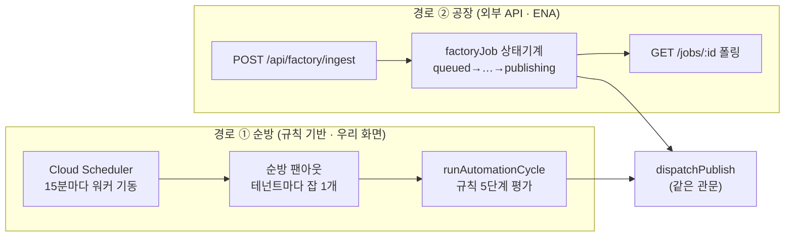

# 자동배포가 멈추는 경우 전수 — 무엇이 일어나고, 사용자는 어떻게 알고, 어떻게 다시 시키나

> 2026-08-17 작성. `automation-cycle.ts` · `factory.ts` · `credits.ts` · `auto-topup.ts` ·
> `content-pipeline.ts` 를 읽어 **실제 코드 동작**으로 채웠다. 추정은 "미확인" 으로 표시했다.
>
> 왜 이 문서인가: 자동배포의 실패는 **조용한 정지**로 나타난다. 규칙은 "실행 중" 인데
> 아무것도 안 나가는 상태가 이 리포의 최빈 실패모드다. 그래서 "무엇이 멈추나" 보다
> **"사용자가 그걸 어떻게 알게 되나"** 를 같은 표에 나란히 둔다.

---

## 0. 자동배포는 두 개의 다른 경로다

두 경로는 **게시 관문은 공유**하지만 **알림 방식이 완전히 다르다.**
순방은 화면(실행 로그·배너)으로 말하고, 공장은 **응답과 폴링으로만** 말한다.
공장 경로에는 웹훅·콜백이 없다(2026-08-17 확인).

---

## 1. 돈이 바닥날 때 — 정지 지점 6개

크레딧은 **분석에만 든다.** 게시·렌더는 크레딧을 소모하지 않는다. 그런데 아래 6번 때문에
잔액이 0 이면 **이미 값을 치른 클립의 게시까지 멈춘다.**

| # | 언제 | 지금 동작 | 사용자가 아는 방법 | 어떻게 다시 도나 |
|---|---|---|---|---|
| 1 | 공장 접수 (`/api/factory/ingest`) | 잔액 ≤ 0 이면 **402 즉시 거절** | API 응답 `insufficient_credits` | 충전 후 **호출자가 다시 호출**(ENA 몫) |
| 2 | 업로드·from-youtube 접수 | 업로드는 성공, **분석만 보류** | 회차 화면 ⚠ `blockedReason` "크레딧 부족 — 충전 후 분석을 시작하세요" | 🔴 **사람이 분석을 다시 눌러야 한다** — 충전해도 자동 재개 없음 |
| 3 | 공장이 분석 태우기 직전(길이 기반 정밀 판정) | 잡 `failed` · "크레딧 부족 — N개 모자랍니다" | `GET /api/factory/jobs/:id` 폴링 | `POST /api/factory/jobs/:id/retry` |
| 4 | 분석이 도는 중에 소진 | **끝까지 돈다.** 차감으로 잔액이 음수로 갈 수 있다(의도 — 원가는 이미 나갔다) | 잔액 표시 | — |
| 5 | 차감 직후 자동충전 | 정책이 켜져 있으면 저장카드로 자동 결제. 상한 3중(일 횟수·월 금액·절대상한) | 성공은 원장 행으로 보인다. 🔴 **실패(카드 한도·정지·월 상한)는 서버 로그만** | 카드 교체 후 다음 분석 완료 시 재시도 |
| 6 | 다음 순방 시작 | 잔액 ≤ 0 이면 **순방 전체 정지**(채택도 게시도 안 함) | 자동배포 화면 배너 `idleReason` = "크레딧 부족 — 충전 필요" | 충전 → **다음 순방(15분)에 자동 재개** |

**6번의 두 가지 부작용**

- 🔴 **실행 로그에는 한 줄도 안 남는다.** 배너(`idleReason`)는 "지금 상태" 라서, 지나간
  시간에 왜 안 나갔는지는 로그에 없다. 로그만 보는 사람은 원인을 못 찾는다.
- 🔴 **게시까지 멈춘다.** 렌더까지 끝난 클립(=이미 크레딧을 쓴 결과물)이 잔액 0 때문에
  배달되지 않는다. 크레딧은 분석 비용인데 게시가 인질이 되는 구조다.

---

## 2. 영상 소스가 없을 때 — 상황이 5가지로 갈린다

"소스가 없다" 는 한 가지가 아니다. 넷은 **완전히 조용하고**, 하나는 **거짓 희망을 준다.**

| # | 상황 | 지금 동작 | 사용자가 아는 방법 |
|---|---|---|---|
| 1 | 규칙의 프로그램에 회차가 아예 없다 | `continue` — 평가만 하고 넘어감 | 🔴 **없음.** 로그 0줄 · 배너 없음 |
| 2 | 회차는 있는데 **채택할 추천이 없다**(전부 채택·거절됨) | 후보 0건 → 아무 일 없음 | 🔴 **없음** |
| 3 | 구간이 기존 클립과 겹쳐 전부 제외됨(재분석 후) | 후보 0건 | 🔴 **없음** |
| 4 | top3 상한(회차당 3건) 도달 | 후보 0건 | 🔴 **없음** (하루 할당량과는 다른 축인데 로그가 없다) |
| 5 | 소스 파일이 사라짐(GCS 삭제·경로 변경) | 공장: `failed` "미디어가 사라졌다" 순방: 렌더 요청 실패 → **매 순방 재요청** | 🔴 공장은 폴링으로 알 수 있다. 순방은 매번 **"렌더 대기 — 완료되면 다음 순방에 자동으로 게시됩니다"** 를 쌓는다 — 영원히 오지 않는 완료를 약속한다 |

> ⚠️ 5번이 제일 위험하다. AI 리프레임에는 "30분째 진행 없으면 기본 크롭으로 강등" 하는
> 안전벨트가 있는데(`REFRAME_STUCK_MS`), **렌더 실패에는 같은 장치가 없다.** 실패 원인이
> 영구적이면(소스 소실·코덱 문제) 그 클립은 조용히 영영 미게시인데, 로그는 계속 낙관적이다.
>
> "ENA 가 보낼 아카이브를 다 소진했다" 는 우리가 알 수 없는 상태다 — 호출자 쪽 사정이고,
> 우리는 요청이 안 오는 것으로만 관측된다. 이건 구멍이 아니다.

---

## 3. 이미 잘 막혀 있는 것 (건드리지 말 것)

실패 모드를 논할 때 **이미 값을 치르고 세운 안전장치**를 같이 적어 둔다. 없애면 재발한다.

| 경우 | 지금 동작 | 왜 이렇게 됐나 |
|---|---|---|
| 배포 실패 | **자동 재시도 안 한다.** 채널별로 사유 1줄 남기고 사람의 재시도 버튼을 기다린다 | 업로드가 시작된 뒤 응답만 유실된 실패면 재시도가 **채널에 중복 업로드**를 만든다 |
| 하루 할당량 소진 | 채널당 하루 1줄만 로그 | 순방이 15분마다 도는데 매번 쌓으면 로그가 사유로 덮인다 |
| 업로드 게이트 OFF (youtube·naver) | 큐잉·`published` 기록·한도 차감 **전부 안 하고** 사유만 남긴다 | 예전엔 큐잉하고 한도까지 깎아서 워커가 전부 실패로 만들었다 |
| 게이트 OFF (tiktok·ig·fb) | 기록만 남긴다 + "기록만 됨" 명시 | 그건 record_only 규칙의 제품 동작이라 막지 않는다 |
| 권리 이슈·승인 필요 | 보류(hold) → **사람이 확정해야** 다시 잡힌다 | 시간이 지났다고 저절로 풀리면 게이트가 무의미하다 |
| 같은 구간 중복 채택 | 겹침 50% 초과면 제외 | 재분석이 추천 ID 를 새로 만들어 이미 나간 구간이 재배포됐다 |
| 계정 미상 배포 기록 | 보수적으로 건너뛰고 **사유를 남긴다** | 조용히 넘기면 "왜 이 클립만 안 나가지" 를 추적할 근거가 없다 |
| AI 리프레임 정체 | stale 은 재분석, failed·30분 정체는 기본 크롭 강등 | `/export` 가 영원히 409 라 클립이 조용히 영영 미게시됐다 |
| 채널 메타데이터 없음 | 생성 잡 재큐잉 + "대기" 로그, 이번 순방은 넘김 | 폴백(clip.title)으로 나가면 채널별 제목·태그가 미반영 |
| 활동 시간창 밖 | `idleReason` 으로 대기 표시 | — |
| 순방 잡 자체가 예외 | 던지지 않고 로그만 — 큐 백오프를 안 탄다 | 백오프를 타면 같은 회차를 반복 평가한다 |

---

## 4. 알림 수단 — 지금은 화면 세 곳뿐이다

**이메일·푸시·웹훅이 하나도 없다**(2026-08-17 확인). 사용자가 상태를 알 수 있는 곳:

| 어디 | 무엇을 보여주나 | 한계 |
|---|---|---|
| 자동배포 화면 | 배너(`idleReason`) · 실행 로그 50건 · 보류 큐 · 채널별 오늘 게시 수 · 게이트 배지 | **보러 와야 안다.** 지나간 정지 사유는 로그에 없으면 사라진다 |
| 회차 화면 | `pipeline.blockedReason` (크레딧 부족 · 분석 실패) | 회차별로 봐야 한다 |
| 배포 기록 | 행별 status·error + 재시도 버튼 | 클립별로 봐야 한다 |
| (공장) `GET /api/factory/jobs/:id` | 상태·에러·클립·배포 결과 | **호출자가 폴링해야 한다.** 콜백 없음 |

즉 **아무도 화면을 안 보면 아무 일도 통보되지 않는다.** 무인 운영을 전제한 기능인데
통보 채널이 없는 게 지금 가장 큰 구조적 공백이다.

---

## 5. 고칠 순서 (권고)

값이 큰 것부터. 전부 서버 쪽 변경이고 추가 API 비용은 0 이다.

| 순위 | 무엇 | 메우는 구멍 | 규모 |
|---|---|---|---|
| 1 | **순방 종료 시 "왜 아무것도 안 했는지" 1줄 요약 로그** — 회차 없음·후보 없음·상한 도달·크레딧 부족을 규칙별로 하루 1회 | §1-6 로그부재 · §2-1·2·3·4 (조용한 정지 4종) | 작음 |
| 2 | **렌더 실패에도 stuck 강등** — N회 실패 또는 M분 정체면 `failed` 로 확정하고 사람에게 넘긴다 | §2-5 (거짓 희망) | 작음 |
| 3 | **충전 후 보류된 분석 자동 재개** — 잔액이 회복되면 `blockedReason` 이 붙은 회차를 다시 큐잉 | §1-2 | 중간 |
| 4 | **게시를 크레딧 게이트에서 분리** — 잔액 0 이면 채택·분석만 막고, 이미 렌더된 클립은 내보낸다 | §1-6 (게시 인질) | 작음 · **제품 결정 필요** |
| 5 | **자동충전 실패를 화면에** — 실행 로그/배너에 "카드 승인 거절" 을 남긴다 | §1-5 | 작음 |
| 6 | **공장 콜백(웹훅)** — 상태 전이·실패를 호출자에게 밀어 준다 | §0 폴링 의존 | 중간 |

4번만 제품 결정이 필요하다(잔액 0 인 워크스페이스의 결과물을 내보낼 것인가). 나머지는
"조용한 실패를 말하게 만드는" 변경이라 방향이 하나다.

---

## 관련 문서

- [how-it-works.md](how-it-works.md) — 파이프라인·원가 정본
- [runbook.md](runbook.md) — 장애 대응 절차
- [worker-queue.md](worker-queue.md) — 큐·재시도·레인 구조
- [../plans/active/ena-auto-deploy-launch.md](../plans/active/ena-auto-deploy-launch.md) — ENA 오픈 계획
