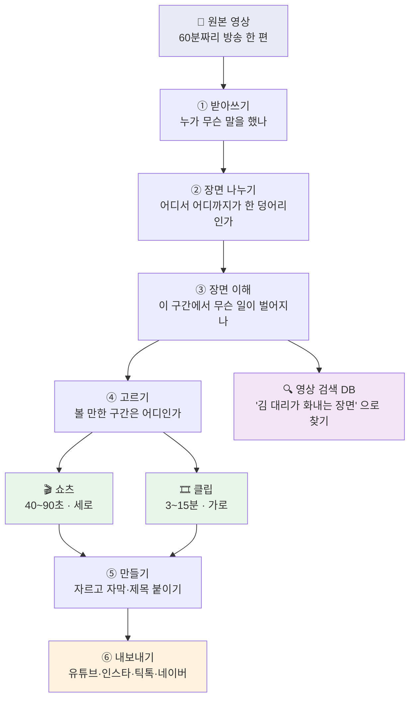
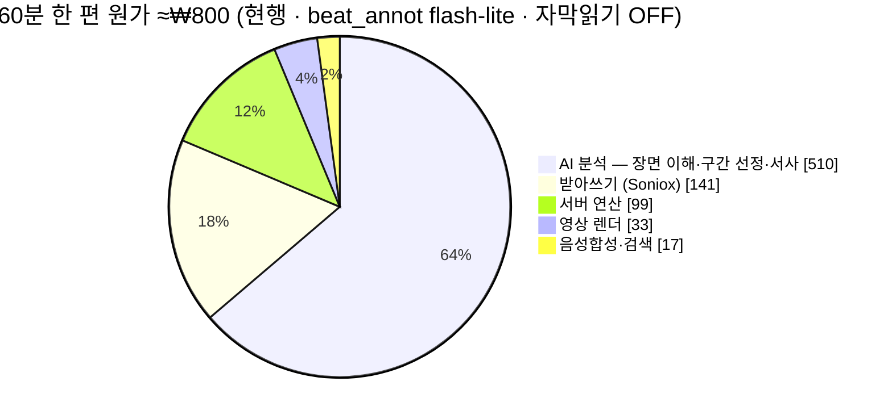
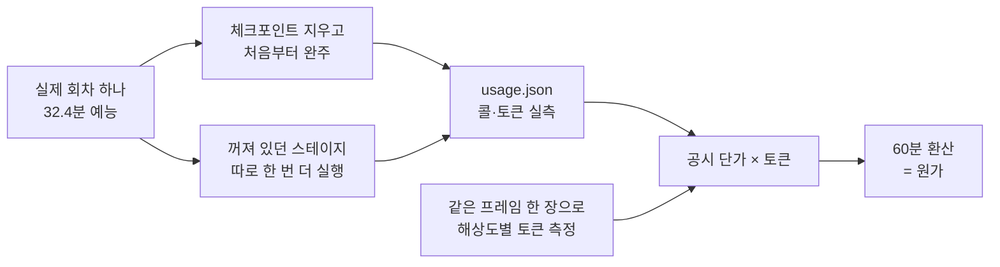

# STEP D — 어떻게 돌아가고, 한 편에 얼마 드는가

> 2026-08-16 작성. **영업·기획·경영 판단을 위한 문서**다. 개발 용어는 뒤(§7 기술 상세)로
> 몰아 뒀으니 앞에서 여섯 장만 읽으면 제품 전체가 잡힌다.
>
> 숫자는 **실측과 추정을 구분**해 적었다. 확정이 필요한 항목은 §7-4 에 표시돼 있다.

---

## 1. 한 줄로

**긴 방송 영상을 넣으면, AI가 볼 만한 구간을 찾아 짧은 영상으로 만들고, 채널에 알아서 올린다.**

방송사가 쌓아만 두고 못 쓰던 아카이브를 다시 파는 것이 목적이다.

---

## 2. 전체 그림



**두 갈래 결과물이 나온다.**

| | 쇼츠 | 클립 |
|---|---|---|
| 길이 | 40~90초 | 3~15분 |
| 화면 | 세로 (9:16) | 가로 (16:9) |
| 어디에 | 유튜브 쇼츠·릴스·틱톡 | 유튜브 일반 영상 |
| 돈은 | 조회수 광고 | **8분 넘으면 중간광고**까지 |
| 회차당 | 약 20편 | 약 3편 |

---

## 3. 한 편이 만들어지는 데 걸리는 시간

60분짜리 방송 한 편 기준 **약 16분**. 사람은 그동안 아무것도 안 해도 된다.

```mermaid
gantt
    title 60분 방송 한 편 처리 (총 ~16분)
    dateFormat  X
    axisFormat %s초
    section 듣기
    받아쓰기(STT)        :0, 240
    section 보기
    장면 나누기           :240, 360
    장면 이해(AI)         :360, 720
    section 고르기
    쇼츠·클립 선정        :720, 840
    검색DB 적재           :840, 900
    section 만들기
    영상 렌더             :900, 964
```



> 렌더(자르고 자막 얹기)는 사람이 채택한 뒤에 도는 별도 단계라, 위 시간에는 대표적인
> 분량만 들어 있다. 클립 3편을 다 만들면 여기에 10~15분이 더 붙는다.

---

## 4. 💰 한 편에 얼마 드는가 — 60분 기준

> ✅ **2026-08-17 실측 확정.** 32.4분 실제 회차를 처음부터 끝까지 돌려(₩450 · 158콜) 재고,
> 지금은 꺼져 있는 화면 자막 읽기를 따로 한 번 더 돌려(₩658 · 780콜) 켰을 때 값도 같이 쟀다.
> 그전까지 문서를 돌던 ₩285·₩994·₩1,510 은 전부 과소계상이었다(경위는 §7-4).
>
> 🔄 **2026-08-19 갱신: beat_annot(장면이해 본체)를 gemini-2.5-flash-lite 로 전환**(−72% 실측 · §6).
> 아래 표의 **'현행'은 이 반영분**이다 — 옛 값(flash · 마진 31%)은 참고 열로만 남긴다.

### 결론 — 2026-08-19 flash-lite 전환으로 **마진 약 51%** · 화면 자막 읽기를 켜도 흑자

원가는 두 스위치로 갈린다: 장면이해 모델(`GEMINI_BEAT_ANNOT_MODEL`)과 화면 자막 읽기
(`RUN_CHYRON_PER_SEG`). **프로덕션 현재**(2026-08-19~): 장면이해 본체(beat_annot)를
**gemini-2.5-flash-lite** 로 돌리고(`VERTEX_LOCATION=global`), 화면 자막 읽기는 **OFF**
(`RUN_CHYRON_PER_SEG=0`). beat_annot 를 flash-lite 로 옮겨 **−72%**(실측 · §6) — 원가가 크게 내렸다.
(⚠️ env 는 짐작 말고 조회 — `gcloud run jobs describe stepd-worker-content --region us-central1`.)

| | **현행** (flash-lite · 자막읽기 OFF) | 자막읽기 ON @ flash-lite | (참고) 2026-08-19 이전 (flash · OFF) |
|---|---|---|---|
| 원가 | **≈₩800** (분당 ₩13.3) | ≈₩1,283 (분당 ₩21.4) | ₩1,124 (분당 ₩18.7) |
| 판매가 (크레딧 ₩28 × 60분) | ₩1,680 | ₩1,680 | ₩1,680 |
| 카드 수수료(3.2%) 뺀 순매출 | ₩1,626 | ₩1,626 | ₩1,626 |
| **한 편 남는 돈** | **+₩826 (약 51%)** | +₩343 (약 21%) | +₩502 (31%) |

**그래서 지금 파는 가격(크레딧 ₩28/분)에 마진이 약 51% 로 넉넉하다.** 화면 자막 읽기(인물
검색축·화자 실명)를 켜도 flash-lite 면 흑자다(마진 ~21%) — 켤지는 비용이 아니라 품질/우선순위
결정이다. (측정·검증 경위는 §6·§7-4 · memory `flash-lite-vision-cost-lever`.)

### 원가 내역 (현행 · flash-lite · 자막읽기 OFF)



| 항목 | 현행 (flash-lite) | 2026-08-19 이전 (flash) | 무엇 |
|---|---|---|---|
| AI 분석 — 장면 이해·구간 선정·서사 | **≈₩510** | ₩834 | beat_annot(본체)를 flash-lite 로 −72% · 구간선정·서사·분류는 flash 유지 |
| AI 분석 — **화면 자막 읽기** | — (OFF) | — (OFF) | 켜면 +₩440(flash-lite · 자막 세그마다 Vision 1콜) |
| 받아쓰기 | ₩141 | ₩141 | 음성 → 자막 (Soniox) |
| 서버 연산 | ₩99 | ₩99 | 연산시간 실측 9.2분/32.4분 |
| 영상 렌더 | ₩33 | ₩33 | 쇼츠 20편 + 클립 3편 |
| 음성합성·검색 | ₩17 | ₩17 | 훅 내레이션 + 검색 임베딩 |
| **합계** | **≈₩800**<br>분당 ₩13.3 | ₩1,124<br>분당 ₩18.7 | |

> **콜 수로도 금액으로도 화면 자막 읽기가 1위다** — 938콜 중 780콜(83%), 원가의 51%.
> 콜당 입력 1,943 토큰인데 그중 **1,806 이 이미지 값**이다(프롬프트는 134). 그래서
> 프롬프트를 줄이거나 여러 장을 묶어 보내는 절감은 거의 효과가 없다(§6).

### 이 돈으로 무엇을 사는가 — 화면 자막 읽기의 값

32.4분 회차에서 780콜을 써서 **54개 세그먼트에 실명이 붙었다**(6.9%). 적어 보이지만
이게 하는 일은 이름표 읽기가 아니라 **화자분리 오류 교정**이다. 실측에서 화자 묶음이
이렇게 섞여 있었다 — 사람 4명으로 묶였는데 실제로는 5명 이상이 한 묶음에 들어 있다.

| 화자 묶음 | 읽힌 이름 (횟수) |
|---|---|
| S1 | 영수 6 · 옥순 5 · 정숙 1 |
| S2 | 정숙 10 · 영수 9 · 옥순 7 · 순자 2 |
| S4 | 영수 8 · 정숙 5 |

그래서 "묶음마다 두 번만 읽고 그만두기"(-97%) 같은 절감이 **불가능하다** — 묶음 하나에
이름을 하나만 주면 296개 세그먼트가 통째로 엉뚱한 사람이 된다.

> 🔴 **지금 프로덕션은 이걸 끄고 팔고 있다.** 즉 배포되는 결과물에 **화자 실명이 없다**
> (화자는 S1·S2 같은 익명 라벨로 남고, 인물 검색축은 사전등록 캐스트에만 의존한다).
> "영상 DB + 검색" 이 제품의 목적물이라면 인물 필터축은 그 핵심이라, 이건 비용 절감이
> 아니라 **기능을 뺀 상태**로 봐야 한다. 켜는 값은 배치 모드 기준 60분 ₩609 이고,
> 그러면 마진이 31% → 거의 본전(-₩107)이 된다. 판매가를 분당 ₩31 로 올리면 켠 채로 흑자다.

### 어떻게 쟀나 — 이 숫자를 믿어도 되는 이유

원가는 이 리포에서 **네 번 틀렸다.** 그래서 "얼마" 만 적지 않고 **어떻게 쟀는지**를 같이 남긴다.
다음 사람이 같은 방법으로 다시 재서 대조할 수 있어야 숫자가 살아 있는 값이 된다.



**1단계 — 진짜 회차를 처음부터 끝까지 돌린다.** 32.4분 예능 한 편(`m_981d7c08`)을 체크포인트
없이 완주시켰다. 여기서 나온 `usage.json` 이 158콜 · 입력 735,785 · 출력 38,884 토큰이다.

**2단계 — 로그에 안 담긴 스테이지를 찾아낸다.** `stage_sec` 에 화면 자막 읽기가 **아예 없었다.**
원인은 로컬 `apps/server/.env` 의 `RUN_CHYRON_PER_SEG=0`. 그래서 같은 회차의 자막 780개에
대해 그 스테이지만 따로 돌려 쟀다(780콜 · 입력 1,515,433 토큰).

**2-1단계 — 프로덕션이 실제로 어떤 구성인지 조회한다.** 여기서 한 번 더 틀렸다. 리포에
`RUN_CHYRON_PER_SEG` 를 켜는 코드가 없으니 "기본값 ON 이겠지" 라고 넘겼는데, Cloud Run 잡을
직접 조회하니 **잡 env 에 `RUN_CHYRON_PER_SEG=0` 이 박혀 있었다**(리포 밖에서 설정된 값).
`gcloud run jobs describe stepd-worker-content --region us-central1` — **env 는 짐작하지 말고
조회할 것.** 원가가 두 배 갈리는 스위치였다.

**3단계 — 단가는 추정하지 않고 재본다.** 이미지 토큰이 해상도에 비례한다는 통념이 맞는지
같은 프레임 한 장을 크기만 바꿔 보내 `prompt_token_count` 를 직접 읽었다. 결과는 §6 에 있다 —
**틀린 통념이었다**(768~1920 이 전부 같은 값).

**4단계 — 60분으로 환산한다.** 32.4분 값에 `×60/32.4`. 콜 수가 영상 길이에 선형인 스테이지들
(자막 세그먼트 수 · beat 수)이라 선형 환산이 맞다.

**5단계 — 남은 추정은 추정이라고 적는다.** 렌더(₩33)와 음성합성(₩17)은 아직 계산값이다.
합계의 2%라 결론이 바뀌지 않지만, 실측과 섞어 적지 않는다.

> **재현하려면**: `RUN_CHYRON_PER_SEG=1` 로 회차를 완주시키고 `usage.json` 을 보면 된다.
> 스테이지별 콜 수를 대조할 것 — 이 회차는 자막읽기 780 + beat 128 + 추천 21 + 서사 5 +
> 장면분류 4 = 938콜이었다. **합이 안 맞으면 뭔가 꺼져 있는 것이다.**

**이번에 걸린 함정 세 가지** — 값을 인용하기 전에 이 셋을 확인할 것.

| 함정 | 증상 | 확인법 |
|---|---|---|
| 체크포인트 재개 실행 | 일부 스테이지만 `usage.json` 에 담긴다 | `stage_sec` 에 0.0 인 단계가 있는지 |
| env 로 꺼진 스테이지 | 로그에 그 단계 줄이 아예 없다 | 콜 수 합이 위 938 구성과 맞는지 |
| 자격증명 경로 깨짐 | 모든 Gemini 콜이 실패하는데 파이프라인은 완주하고 `calls=0` | `usage.json` 의 `calls` 가 0 이 아닌지 |

### 옵션을 켜면

| 옵션 | 추가 | 켤 만한가 |
|---|---|---|
| 썸네일 — **프레임 방식** | **₩0** | ✅ 기본값. 영상에서 한 장 뽑아 자막만 얹는다 |
| 썸네일 — AI 생성 방식 | +₩500 | 🔴 지금 마진(₩502)을 통째로 먹는다 — 별도 과금 항목으로 빼야 한다 |
| 장면경계 정밀분석(GEBD) | +₩369 | 🔴 마찬가지. 품질 옵션으로 분리해 별도 과금해야 한다 |
| 화면 자막 읽기 (배치 모드) | +₩609 | ⚖️ 마진 31% → 거의 본전. **인물 검색축을 사는 값** |

---

## 5. 손익분기 — 월 몇 편부터 남는가

매달 아무것도 안 돌려도 나가는 돈이 **₩56,600** 있다(데이터베이스·서버 이미지 보관 등).

**현행 구성(flash-lite · 자막읽기 OFF)은 편당 ₩826 남으므로 손익분기는 월 약 69편이다.**

| 월 회차 | 현행(flash-lite·OFF) 손익 | 자막읽기 ON @ flash-lite 손익 |
|---|---|---|
| 30편 | -₩31,800 | -₩46,300 |
| **69편** | **≈ ±0** | -₩33,000 |
| 100편 | +₩26,000 | -₩22,300 |
| 300편 | +₩191,200 | +₩46,300 |

- 현행(분당 ₩13.3) → 편당 +₩826 → 손익분기 **월 ~69편**
- 자막읽기를 flash-lite 로 켜면(분당 ₩21.4) → 편당 +₩343 → 손익분기 월 ~165편 (여전히 흑자 가능)
- (옛 flash 구성: 편당 +₩502 → 월 113편. 자막읽기를 flash 로 켜면 편당 -₩759 로 흑자 구간 없었다.)

---

## 6. 원가를 줄일 수 있는 곳

원가의 86%가 AI 분석이라 **거기 말고는 볼 곳이 없다.** 2026-08-17 에 후보를 하나씩 실제로
돌려서 재봤고, **네 개 중 셋이 효과가 없었다.** 안 되는 것도 남겨 둔다 — 다음 사람이 같은
곳을 또 파지 않게.

| 레버 | 실측 결과 | 상태 |
|---|---|---|
| **자막읽기 스위치 끄기** | -₩1,218 | ✅ **이미 이 상태다**(프로덕션 잡 env). beat_annot flash-lite 와 합쳐 지금 마진이 ~51% 다 — 대신 인물 검색축·화자 실명이 없다 |
| **beat_annot flash-lite** | -₩324 (장면이해 −72%) | ✅ **적용 완료(2026-08-19).** 현행 원가 ₩1,124→₩800 · 마진 31%→51%. §4·§6 참조 |
| **Gemini 배치 모드** | 단가는 정확히 **-50%** 확인(₩658 → ₩329) 인데 **한 회차에 5시간 45분** | ⚠️ 구현 완료·**기본 OFF**(2026-08-17 실측). 지금 구조(파이프라인이 기다림)로는 못 쓴다 — 아래 참조 |
| 자막읽기 표본화 (2세그마다) | -₩609 이지만 **이름 세그 54개 중 29개 손실** | 반값에 절반을 잃는다 — 사실상 스위치를 반만 끄는 것 |
| ~~프레임 해상도 축소~~ | ❌ **절감 0원** | 768·960·1280·1920 이 **전부 1,806 토큰 동일**. 512 로 내리면 -29% 지만 **글자를 못 읽는다**(54개 전부 빈 응답) |
| ~~자막 띠만 잘라 보내기~~ | ❌ **오히려 +₩1,000** | 아래 45% 크롭이 2,975 토큰(더 비쌈) · 판독 0/54 |
| ~~여러 프레임 묶어 한 콜~~ | ❌ 최대 -7% | 콜당 1,943 토큰 중 프롬프트가 134 뿐 — 묶어도 이미지 값은 그대로 |
| ~~묶음마다 2번만 읽고 종료~~ | ❌ 품질 붕괴 | -97% 지만 화자 묶음에 여러 사람이 섞여 있다(§4) |
| Gemini Flash-Lite 로 교체 | **-67% 실측 확정** (chyron 60분 ₩1,334 → ₩440) | ✅ **검증됨(2026-08-19).** 거주 허락 확보 → `global` 엔드포인트로 flash-lite MaaS 사용(asia-northeast3 은 여전히 404). 실제 `scan_per_seg` A/B(8분·211세그)로 -67% + 한국어 판독 동등~더 높은 recall 확인. 드롭인(env 만 · 기본 flash 유지 = 프로덕션 미변경). ⚠️ 유사가명(나는SOLO 영수/영호/영철) canonicalizer 과병합은 별도 이슈 |
| Qwen3-VL 로 교체 | ❌ **지금 물량엔 더 비쌈** | Vertex Model Garden 의 `qwen3-vl` 전 사이즈가 **셀프배포 전용**(MaaS 없음) = GPU 시간 과금. H100 상시 월 ₩11.2M · L4 월 ₩720k vs flash-lite 회차 ₩270. 월 수천 회차 넘기 전엔 손해 (2026-08-19 조회) |
| 썸네일 프레임 방식 | -₩500 | ✅ 적용 완료(2026-08-16) |
| 클립·훅 선정 | LLM 대신 계산으로 | ✅ 적용 완료 — 추가 비용 0 |

### 배치 모드 — 무엇이 반값이 되고, 무엇이 안 되나

**배치로 묶을 수 있는 건 화면 자막 읽기 하나다.** 콜끼리 서로의 결과에 의존하면 한 잡에
넣을 수 없기 때문이다.

| 스테이지 | 콜 수 | 배치 | 왜 |
|---|---|---|---|
| 화면 자막 읽기 | 780 | ✅ | 자막 세그마다 독립 판정 — **한 잡에 780건 전부** |
| 장면 이해(beat) | 128 | ❌ | 앞 장면 이해 결과를 다음 프롬프트에 쌓는다(맥락 도미노). 묶음 단위로 쪼개면 21개 잡을 순차 대기해야 해서 더 느리다 |
| 구간 선정 | 21 | ❌ | 후보 뽑기 → 고르기 → 검수가 서로의 결과에 의존 |
| 서사·장면분류 | 9 | ❌ | 가능하지만 9콜 아끼려고 잡 대기를 무는 건 손해 |

그래서 절감은 **AI 분석 전체의 반값이 아니라 자막읽기의 반값**이다. 그리고 자막읽기가
꺼져 있는 지금은 **배치가 절감할 대상이 없다** — 아래는 자막읽기를 켤 때의 비교다.

| 자막읽기 ON 기준 | 배치 OFF | 배치 ON |
|---|---|---|
| 화면 자막 읽기 | ₩1,218 | **₩609** |
| 나머지 AI 분석 | ₩834 | ₩834 |
| 그 외(받아쓰기·연산·렌더 등) | ₩333 | ₩290 |
| **60분 원가** | ₩2,385 (분당 39.8) | **₩1,733 (분당 28.9)** |
| 한 편 손익 | -₩759 | **-₩107** (거의 본전) |

**즉 배치는 "자막읽기를 켤 수 있게 만드는" 레버다.** 켜면서 배치까지 켜면 적자가 ₩759 →
₩107 로 줄고, 판매가를 분당 ₩31 로 올리면 켠 채로 흑자다. 단 아래 실측대로 **시간을 낸다.**

### 대가는 시간이고, 그 시간이 예상보다 훨씬 컸다 (실측)

780건(32.4분 회차의 자막읽기 전량)을 실제로 배치로 돌렸다.

| | 결과 |
|---|---|
| 원가 | **₩329.11** — 동기 ₩657.53 의 **정확히 절반** ✅ |
| 응답 짝짓기 | 780/780 ✅ |
| 제출 → 실행 시작 | 5분 19초 |
| **제출 → 종료** | **5시간 45분** 🔴 (동기는 4분) |

**그래서 기본 OFF 로 뒀다.** 지금 구현은 파이프라인이 폴링하며 기다리는 구조라 상한(25분)에서
잡을 취소하고 동기로 되돌아간다 — **25분 버리고 제값 내는** 최악의 조합이다. 켜려면 구조를
바꿔야 한다: ① 제출만 하고 스테이지를 끝낸다 ② 몇 시간 뒤 별도 잡이 결과를 수거해 화자 실명과
검색 인덱스를 갱신한다. 즉 배치는 **"분석 결과가 몇 시간 뒤에 채워져도 되는가"** 라는 제품
질문이 먼저다. 자동배포·백필은 괜찮고, 사람이 업로드하고 기다리는 경로는 안 된다.

> ⚠️ 폴백할 때 잡을 **반드시 취소한다**(구현돼 있다). 안 그러면 우리가 안 읽을 결과를 서버가
> 끝까지 만들고 요금은 그대로 청구된다 — 동기 재실행분과 합쳐 이중 지불이다.
> 잡 상태(`state`) 필드는 실제 진행보다 늦게 반영된다(실측: 이미 실행 중인데 조회는 `PENDING`).

그래서 **사람이 기다리는 업로드 경로보다 자동배포·백필처럼 기다리는 사람이 없는 경로에 맞다.**
켜는 법과 걸렸는지 확인하는 법은 §7-6.

---

## 7. 기술 상세 — 여기부터는 개발용

<details>
<summary><b>7-1. 파이프라인 단계와 코드 위치</b></summary>

```
업로드 (GCS resumable)
  └─ content.analyze 잡 큐잉 → [Cloud Run Job] python -m core.analyze
       ├─ STT            core/stt/          Soniox v5 + PyAnnote 화자분리
       ├─ shot boundary  core/scenes/       ffmpeg scene-score
       ├─ scene_type     core/scenes/
       ├─ (옵션) GEBD    GPU T4 spot VM     장면경계 정밀화 · AUTO_GEBD
       ├─ beat 생성      core/beats/        최소 6초 · 회차당 약 245개
       ├─ beat annotate  core/beats/        Vision · 맥락 누적
       ├─ 신호 추출      core/recommend/signals.py   오디오 RMS·컷·대사밀도 (API ₩0)
       ├─ 쇼츠 추천      core/recommend/    beat 조합 · 결정론 점수
       ├─ 클립 조립      core/recommend/    build_clips_from_beats (LLM 없음)
       └─ 검색 인덱싱    core/search/       pgvector 768d
  → content_analysis + search_segments 저장
  → [사람 or 자동배포 설정] 채택 → ffmpeg 트림·인코딩 → 배포
```

단계별 체크포인트가 있어 실패·재시도 시 완료된 단계부터 재개한다(`analyze_utils.py`).
</details>

<details>
<summary><b>7-2. 점수 계산 (score100)</b></summary>

```
score100 = 100 × (0.45·신호 + 0.35·훅 + 0.20·끝맺음) + 시청자지목 보너스(최대 10)
```

| 축 | 무엇 | 출처 |
|---|---|---|
| 신호 0.45 | 오디오 음량 백분위·순간상승·대사밀도·컷속도 | `signals.py` (결정론) |
| 훅 0.35 | 반전·감정고조·웃음 등 9종 카테고리 가중 | beat annotate 라벨 |
| 끝맺음 0.20 | 쇼츠 끝 뒤 침묵 — 말허리에서 끊겼는가 | STT 타임라인 |
| 시청자 +10 | 댓글 타임스탬프가 겹치는 구간 | 원본 유튜브 댓글 |

**LLM에게 점수를 묻지 않는다.** 같은 입력이면 항상 같은 값이 나와야 A/B·회귀 판정이 성립한다.
길이는 점수축이 아니다(품질이 아니라 제약이라, 게시 직전 채널별 기본 조건에서 따로 본다).

오디오 축에는 **음악 방어**가 걸려 있다 — 대사가 거의 없는데 소리만 큰 구간(엔딩 크레딧·BGM)은
기여를 0.35로 감쇠한다. 안 걸면 크레딧이 1등으로 올라온다(실측).
</details>

<details>
<summary><b>7-3. 단가표 (환율 ₩1,416/USD · 2026-08-11)</b></summary>

| 서비스 | 단가 |
|---|---|
| Soniox STT | $0.10/시간 |
| Gemini 2.5 Flash | ₩425 / ₩3,540 per 1M tokens (in/out) |
| Gemini 2.5 Flash-Lite | ₩142 / ₩566 |
| Gemini 2.5 Pro | ₩1,770 / ₩14,160 |
| Vertex 임베딩 | $0.025 / 1M tokens |
| Cloud TTS Neural2 | $16 / 1M chars |
| Cloud Run Job | 4vCPU·8Gi × 실행시간 |
| GEBD GPU VM (L4) | $0.868/시간 |

⚠️ **이 표는 `core/common/retry.py` 와 반드시 같아야 한다.** 2026-08-11 감사에서 그 표가
Gemini 2.0 Flash 가격을 2.5 라벨에 붙여 **4.7배 과소계상**하고 있던 것이 발견됐고
(₩154 → 실제 ₩728), 2026-08-16 에 바로잡았다. 단가가 바뀌면 두 곳을 같이 고칠 것.
</details>

<details>
<summary><b>7-4. 원가 산출 근거</b></summary>

**측정 회차**: `m_981d7c08` · 32.4분 · 2026-08-17 · STT=soniox · GEBD OFF · 썸네일 OFF ·
장르 예능(나는 SOLO). 60분 값은 전부 여기에 `×60/32.4` 를 곱한 것이다.

- **AI 분석 — 장면 이해·서사 ₩834** (실측): 158콜 · 입력 735,785 · 출력 38,884 토큰 →
  ₩450.36. 콜 분해는 beat_annot 128 + recommend 21 + narrative 5 + scene_type 4.
- **AI 분석 — 화면 자막 읽기 ₩1,218** (실측): 780콜 · 입력 1,515,433 · 출력 3,804 → ₩657.53.
  콜당 입력 1,943 토큰이고 그중 **이미지가 1,806**(프롬프트 134 · 텍스트만 보내 확인).
  ⚠️ 이 스테이지는 **로컬 `.env` 에서 `RUN_CHYRON_PER_SEG=0`** 이라 회차 실행 로그에
  안 담긴다. 프로덕션은 env 미설정 = 기본 ON 이므로 **돈다.** 그래서 따로 한 번 돌려 쟀다.
- **해상도별 이미지 토큰** (실측 · 같은 프레임 한 장으로): 1920×1080 · 1280×720 · 960×540 ·
  768×432 가 **전부 1,806**. 512×288 이 1,290, 384×216 이 254. 즉 Vertex 의 타일 계산은
  문서상 공식(`ceil(w/768)×ceil(h/768)×258`)대로 움직이지 않는다 — **추정하지 말고 재야 한다.**
- **받아쓰기 ₩141** (계산): 60분 × $0.10/시간 × ₩1,416.
- **서버 연산 ₩142** (실측): 연산시간 551초(자막읽기 제외) + 243초(자막읽기) = 13.2분/32.4분
  → 60분 약 24.5분. Cloud Run Job 2vCPU·8Gi 초당 $0.000068.
- **영상 렌더 ₩33** (추정): 로컬 실측 9분 클립 인코딩 107초(실시간 5배속). Cloud Run 2vCPU
  기준 보수적으로 2배속 가정 → 클립 3편 약 13분 + 쇼츠 20편 약 3분.
- **TTS ₩14** (계산): 쇼츠 20편 × 약 30자 = 600자 × $16/1M.
- 크레딧 1개 = 분석 1분 = **₩60** (`CREDIT_PRICE_KRW` · 2026-08-25 인하 28→150→60,
  세금 포함 · aena 결제창 표기와 정렬). 청구는 `Math.ceil(초/60)`. 원가 ₩13.3/분 대비 마진 ~78%
  (자막읽기 켜면 원가 ₩20.6/분 → 마진 ~66%).

**숫자가 네 번 고쳐진 경위** — 같은 함정을 다시 밟지 않기 위해 남긴다.

| 값 | 왜 틀렸나 |
|---|---|
| ₩285 | `retry.py` 단가표가 Gemini 2.0 Flash 가격을 2.5 라벨에 붙여 4.7배 과소 |
| ₩994 | 단가는 고쳤지만 근거 `usage.json` 이 **체크포인트 재개 실행**이라 2개 스테이지만 담김 |
| ₩1,510 | 빠진 화면 자막 읽기를 **추정 ₩405** 로 메움 (실제는 3배인 ₩1,218) |
| **₩2,385** | 전체 실행 + 자막읽기 별도 실행. 남은 추정은 렌더·TTS 뿐 |

마진 감시 상수 `billing.ts COST_KRW_PER_MINUTE` 는 **40** (프로덕션 기본 = 자막읽기 ON).
자막읽기를 끄기로 결정하면 **19** 로 내릴 것 — 상수가 실제 구성과 어긋나면 대시보드가
거짓 마진을 보고한다. 이력: 4.9 → 19 → 26 → 40.
</details>

<details>
<summary><b>7-5. 자동배포가 도는 순서</b></summary>


화면 책임은 둘로만 나눈다. **배포 채널**은 OAuth·세션 연결과 연결 상태만 관리하고,
프로그램·채널·선정 기준·일정·템플릿·승인 방식은 **자동배포**에서 한 번에 설정한다.
길이·화면비·공개 범위의 안전 기본값과 최종 게시 판정은 서버 내부에서 유지한다.

자동배포 설정은 여러 개 만들 수 있지만 **같은 채널은 한 자동배포에만 속한다.** 화면에서 이미
사용 중인 채널을 잠그고, `POST /api/automation/rules`도 검사→저장을 테넌트 자문 잠금 안에서
직렬화해 외부 API와 동시 요청의 우회를 409로 막는다. 예약 순방과 `지금 확인`도
`automation-cycle:<tenantId>` 잠금으로 직렬화한다. 둘이 겹쳐 같은 영상을 두 번 큐잉했던
2026-08-24 중복 기록/중복 업로드 경로를 이 잠금이 닫는다.

화면 상단은 `lastCycleAt`·최근 `rule_run`·현재 렌더/승인 대기를 조합해 **현재 상태 / 최근 처리 /
다음 확인**을 따로 보여 준다. 아래 목록도 진행 기록과 실제 `distribution.status=published`가 확인된
완료 영상을 분리한다. `published` 실행 로그 자체는 큐잉 시점이므로 완료로 세지 않는다.

안전장치: 하루 채널당 할당량(기본 3건) · 활동 시간대 · 승인 정책(approve_first) ·
실패 시 자동 재시도 금지(사람이 눌러야 함) · 공개범위 기본 `unlisted`.
</details>

---

<details>
<summary><b>7-6. 배치 모드 구현 — 무엇을 배치로 돌리고 무엇을 안 하나</b></summary>

`core/common/batch.py` · `GEMINI_BATCH=1` · 버킷은 `GEMINI_BATCH_BUCKET`(없으면 `GCS_BUCKET`).

**배치 대상 판정** — 콜끼리 의존이 없어야 한 잡에 넣을 수 있다.

| 스테이지 | 콜 수(32.4분) | 배치 | 이유 |
|---|---|---|---|
| chyron per-seg | 780 | ✅ | 세그마다 독립 판정. 한 잡에 전부 들어간다 |
| beat_annot | 128 | ❌ | 청크마다 앞 beat 결과를 맥락으로 쌓는다(도미노 · 사용자 요청 2026-08-07). 청크 = `BEAT_ANNOT_WORKERS` 라 128/6 ≈ 21개 잡을 **순차 대기**해야 한다 |
| recommend | 21 | ❌ | pool → 선정 → QA 가 서로의 결과에 의존 |
| narrative · scene_type | 9 | ❌ | 가능하지만 9콜 아끼려고 잡 대기를 무는 건 손해 |

**JSONL 한 줄의 형태** (Vertex GCS 배치 규격):

```json
{"request": {"contents": [{"role": "user", "parts": [
  {"inlineData": {"mimeType": "image/jpeg", "data": "<base64>"}},
  {"text": "…프롬프트…\n#REQ:41"}]}],
  "generationConfig": {"temperature": 0, "responseMimeType": "application/json", "…": "…"}}}
```

**`#REQ:{i}` 표식이 핵심이다.** 출력 JSONL 의 줄 순서는 보장되지 않는데, 순서를 믿고 zip 하면
**엉뚱한 세그먼트에 엉뚱한 사람 이름이 붙는다** — 조용히 틀리는 종류라 표식으로 못을 박았다.
표식이 없는 줄은 짝을 모르므로 **버린다**(추측하지 않는다).

**실패는 전부 한 방향** — 버킷 없음 · SDK 없음 · 업로드 실패 · 잡 생성 실패 · 잡 실패 ·
타임아웃 · 출력 없음 · 짝지어진 응답 0건 → 모두 `None` 을 돌려 **동기 경로로 되돌아간다.**
반값을 못 사는 건 손해지만 회차가 안 도는 건 사고다. 타임아웃 때 잡은 살아 있으므로
(로그에 잡 이름이 찍힌다) 나중에 출력만 주워 쓸 수도 있다.

**켰는지 확인법** — `usage.json` 의 `by_model` 키를 본다.

```
"gemini-2.5-flash"        ← 동기 (단가 100%)
"gemini-2.5-flash:batch"  ← 배치 (단가 50% · est_krw 에 반영됨)
```

동기와 **같은 키에 합치지 않는다.** 섞으면 usage.json 만 보고는 배치가 실제로 걸렸는지
알 수 없고, 원가가 절반인지도 구분이 안 된다 — 원가가 네 번 틀린 경위가 다 이런 눈가림이었다.

</details>

## 관련 문서

- [cost-and-dependencies.md](cost-and-dependencies.md) — 비용·의존성 정본(전수 인벤토리)
- [pipeline-current-state.md](pipeline-current-state.md) — 파이프라인 스테이지 상세
- [infra.md](infra.md) — 인프라 SSOT
- [../plans/active/ena-auto-deploy-launch.md](../plans/active/ena-auto-deploy-launch.md) — ENA 오픈 계획
