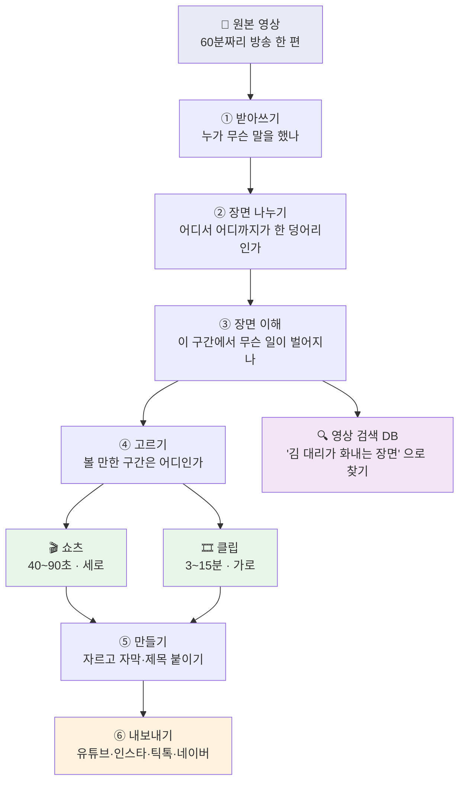
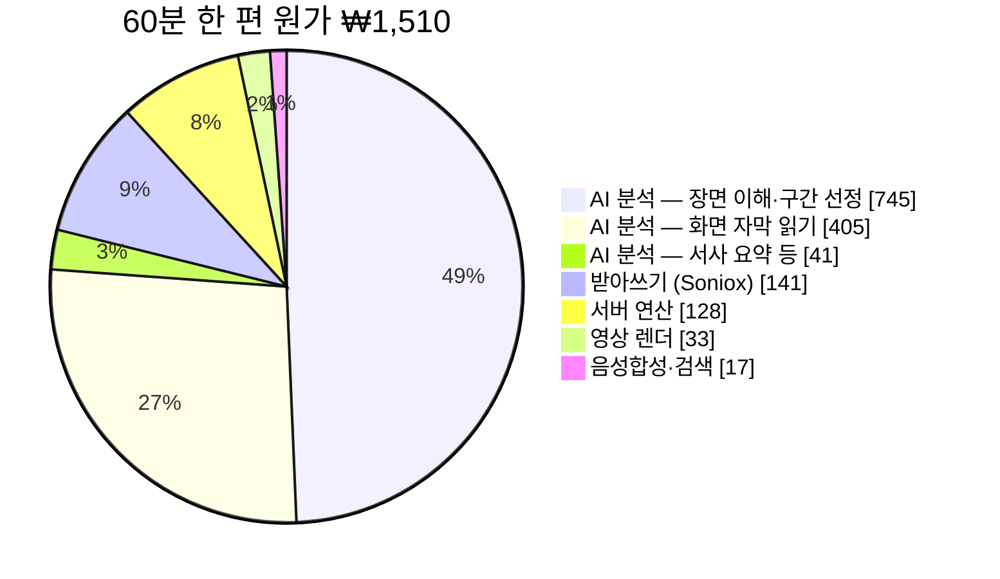
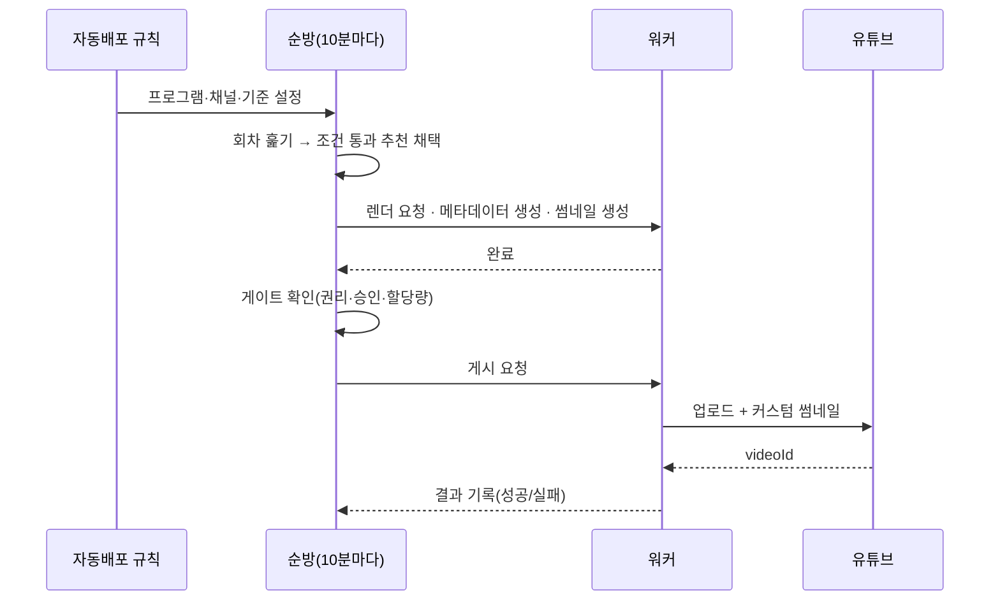

# STEP D — 어떻게 돌아가고, 한 편에 얼마 드는가

> 2026-08-16 작성. **영업·기획·경영 판단을 위한 문서**다. 개발 용어는 뒤(§7 기술 상세)로
> 몰아 뒀으니 앞에서 여섯 장만 읽으면 제품 전체가 잡힌다.
>
> 숫자는 **실측과 추정을 구분**해 적었다. 확정이 필요한 항목은 §7-4 에 표시돼 있다.

---

## 1. 한 줄로

**긴 방송 영상을 넣으면, AI가 볼 만한 구간을 찾아 짧은 영상으로 만들고, 채널에 알아서 올린다.**

방송사가 쌓아만 두고 못 쓰던 아카이브를 다시 파는 것이 목적이다.

---

## 2. 전체 그림



**두 갈래 결과물이 나온다.**

| | 쇼츠 | 클립 |
|---|---|---|
| 길이 | 40~90초 | 3~15분 |
| 화면 | 세로 (9:16) | 가로 (16:9) |
| 어디에 | 유튜브 쇼츠·릴스·틱톡 | 유튜브 일반 영상 |
| 돈은 | 조회수 광고 | **8분 넘으면 중간광고**까지 |
| 회차당 | 약 20편 | 약 3편 |

---

## 3. 한 편이 만들어지는 데 걸리는 시간

60분짜리 방송 한 편 기준 **약 16분**. 사람은 그동안 아무것도 안 해도 된다.

```mermaid
gantt
    title 60분 방송 한 편 처리 (총 ~16분)
    dateFormat  X
    axisFormat %s초
    section 듣기
    받아쓰기(STT)        :0, 240
    section 보기
    장면 나누기           :240, 360
    장면 이해(AI)         :360, 720
    section 고르기
    쇼츠·클립 선정        :720, 840
    검색DB 적재           :840, 900
    section 만들기
    영상 렌더             :900, 964
```



> 렌더(자르고 자막 얹기)는 사람이 채택한 뒤에 도는 별도 단계라, 위 시간에는 대표적인
> 분량만 들어 있다. 클립 3편을 다 만들면 여기에 10~15분이 더 붙는다.

---

## 4. 💰 한 편에 얼마 드는가 — 60분 기준

> ⚠️ **이 숫자는 2026-08-16 에 두 번 고쳐졌다.** 문서마다 돌던 ₩285 는 단가표 오류였고,
> 그걸 고친 ₩994 도 **파이프라인 일부만 담긴 로그**로 계산한 값이었다. 아래가 현재 최선의
> 추정이며, 확정하려면 전체 파이프라인을 한 번 돌려 `usage.json` 을 받아야 한다(§7-4).

### 결론

| | 금액 |
|---|---|
| **원가** | **약 ₩1,510** (분당 ₩25.2) |
| 판매가 (크레딧 ₩28 × 60분) | ₩1,680 |
| 카드 수수료(3.2%) 뺀 순매출 | ₩1,626 |
| **한 편 남는 돈** | **약 ₩120 (7%)** |

**지금 가격은 사실상 본전이다.** 크레딧 ₩28/분은 원가 ₩25.2/분과 거의 같다.

### 원가 내역



| 항목 | 원가 | 무엇 |
|---|---|---|
| AI 분석 (전체) | **₩1,191** | **원가의 79%** — 아래 셋으로 나뉜다 |
| ├ 장면 이해·구간 선정 | ₩745 | beat 227개 각각 + 쇼츠 QA (실측) |
| ├ 화면 자막 읽기 | ₩405 | **자막 세그먼트마다 1콜 = 회차당 약 800콜** |
| └ 서사 요약·장면 분류 | ₩41 | 영상 길이에 비례, 15콜 안팎 |
| 받아쓰기 | ₩141 | 음성 → 자막 (Soniox) |
| 서버 연산 | ₩128 | 분석이 도는 동안의 컴퓨터 값 |
| 영상 렌더 | ₩33 | 쇼츠 20편 + 클립 3편 |
| 음성합성·검색 | ₩17 | 훅 내레이션 + 검색 임베딩 |
| **합계** | **≈ ₩1,510** | 분당 ₩25.2 |

> **콜 수로 보면 화면 자막 읽기가 전체의 75%다**(약 800콜 / 1,050콜). 한 콜은 싸지만
> 횟수가 압도적이라 두 번째로 큰 비용 항목이 된다.

### 옵션을 켜면

| 옵션 | 추가 | 켤 만한가 |
|---|---|---|
| 썸네일 — **프레임 방식** | **₩0** | ✅ 기본값. 영상에서 한 장 뽑아 자막만 얹는다 |
| 썸네일 — AI 생성 방식 | +₩500 | 🔴 지금 마진(₩120)으로는 **즉시 역마진** |
| 장면경계 정밀분석(GEBD) | +₩369 | 🔴 마찬가지. 품질 옵션으로 분리해 별도 과금해야 한다 |

---

## 5. 손익분기 — 월 몇 편부터 남는가

매달 아무것도 안 돌려도 나가는 돈이 **₩56,600** 있다(데이터베이스·서버 이미지 보관 등).

한 편에 ₩120밖에 안 남으므로, **고정비를 덮으려면 월 470편**이 필요하다.

| 월 회차 | 매출 | 원가+고정비 | 손익 |
|---|---|---|---|
| 30편 | ₩50,400 | ₩101,900 | -₩51,500 |
| 100편 | ₩168,000 | ₩207,600 | -₩39,600 |
| 300편 | ₩504,000 | ₩509,600 | -₩5,600 |
| **470편** | ₩789,600 | ₩766,300 | **≈ ±0** |

**이건 지속 가능한 구조가 아니다.** 아래 §6 의 절감을 적용하거나 가격을 올려야 한다.

- 원가를 분당 ₩17 로 낮추면 → 한 편 ₩600 → 손익분기 **월 95편**
- 가격을 ₩35/분으로 올리면 → 한 편 ₩520 → 손익분기 **월 109편**

---

## 6. 원가를 줄일 수 있는 곳

원가의 70%가 AI 분석이라 **거기 말고는 볼 곳이 없다.**

| 레버 | 절감 | 상태 |
|---|---|---|
| **화면 자막 프레임 축소** | **-₩350** (원본 → 720p) | ✅ 적용 완료(2026-08-16) — 이미 위 표에 반영됨 |
| **Gemini 배치 모드** | AI 분석 **-50%** (₩1,191 → ₩595) | 미적용. **가장 큰 레버** |
| 화면 자막 읽기 표본화 | -₩200~300 | 미적용. 지금은 **모든 자막 세그먼트**를 읽는다 — 이름표가 뜨는 구간만 읽어도 된다 |
| 프롬프트 캐시 | 최대 -45% | 일부 적용. 실측 확인 필요 |
| 썸네일 프레임 방식 | -₩500 | ✅ 적용 완료(2026-08-16) |
| 클립·훅 선정 | LLM 대신 계산으로 | ✅ 적용 완료 — 추가 비용 0 |

**배치 모드만 적용해도 원가가 분당 ₩25.2 → ₩15.3 으로 떨어져 손익분기가 월 470편 → 약 78편이 된다.**
자막 표본화까지 하면 분당 ₩11 대까지 내려간다.

---

## 7. 기술 상세 — 여기부터는 개발용

<details>
<summary><b>7-1. 파이프라인 단계와 코드 위치</b></summary>

```
업로드 (GCS resumable)
  └─ content.analyze 잡 큐잉 → [Cloud Run Job] python -m core.analyze
       ├─ STT            core/stt/          Soniox v5 + PyAnnote 화자분리
       ├─ shot boundary  core/scenes/       ffmpeg scene-score
       ├─ scene_type     core/scenes/
       ├─ (옵션) GEBD    GPU T4 spot VM     장면경계 정밀화 · AUTO_GEBD
       ├─ beat 생성      core/beats/        최소 6초 · 회차당 약 245개
       ├─ beat annotate  core/beats/        Vision · 맥락 누적
       ├─ 신호 추출      core/recommend/signals.py   오디오 RMS·컷·대사밀도 (API ₩0)
       ├─ 쇼츠 추천      core/recommend/    beat 조합 · 결정론 점수
       ├─ 클립 조립      core/recommend/    build_clips_from_beats (LLM 없음)
       └─ 검색 인덱싱    core/search/       pgvector 768d
  → content_analysis + search_segments 저장
  → [사람 or 자동배포 규칙] 채택 → ffmpeg 트림·인코딩 → 배포
```

단계별 체크포인트가 있어 실패·재시도 시 완료된 단계부터 재개한다(`analyze_utils.py`).
</details>

<details>
<summary><b>7-2. 점수 계산 (score100)</b></summary>

```
score100 = 100 × (0.45·신호 + 0.35·훅 + 0.20·끝맺음) + 시청자지목 보너스(최대 10)
```

| 축 | 무엇 | 출처 |
|---|---|---|
| 신호 0.45 | 오디오 음량 백분위·순간상승·대사밀도·컷속도 | `signals.py` (결정론) |
| 훅 0.35 | 반전·감정고조·웃음 등 9종 카테고리 가중 | beat annotate 라벨 |
| 끝맺음 0.20 | 쇼츠 끝 뒤 침묵 — 말허리에서 끊겼는가 | STT 타임라인 |
| 시청자 +10 | 댓글 타임스탬프가 겹치는 구간 | 원본 유튜브 댓글 |

**LLM에게 점수를 묻지 않는다.** 같은 입력이면 항상 같은 값이 나와야 A/B·회귀 판정이 성립한다.
길이는 점수축이 아니다(품질이 아니라 제약이라, 배포처 적합·채널 규칙에서 따로 본다).

오디오 축에는 **음악 방어**가 걸려 있다 — 대사가 거의 없는데 소리만 큰 구간(엔딩 크레딧·BGM)은
기여를 0.35로 감쇠한다. 안 걸면 크레딧이 1등으로 올라온다(실측).
</details>

<details>
<summary><b>7-3. 단가표 (환율 ₩1,416/USD · 2026-08-11)</b></summary>

| 서비스 | 단가 |
|---|---|
| Soniox STT | $0.10/시간 |
| Gemini 2.5 Flash | ₩425 / ₩3,540 per 1M tokens (in/out) |
| Gemini 2.5 Flash-Lite | ₩142 / ₩566 |
| Gemini 2.5 Pro | ₩1,770 / ₩14,160 |
| Vertex 임베딩 | $0.025 / 1M tokens |
| Cloud TTS Neural2 | $16 / 1M chars |
| Cloud Run Job | 4vCPU·8Gi × 실행시간 |
| GEBD GPU VM (L4) | $0.868/시간 |

⚠️ **이 표는 `core/common/retry.py` 와 반드시 같아야 한다.** 2026-08-11 감사에서 그 표가
Gemini 2.0 Flash 가격을 2.5 라벨에 붙여 **4.7배 과소계상**하고 있던 것이 발견됐고
(₩154 → 실제 ₩728), 2026-08-16 에 바로잡았다. 단가가 바뀌면 두 곳을 같이 고칠 것.
</details>

<details>
<summary><b>7-4. 원가 산출 근거</b></summary>

- **AI 분석 — 장면 이해 ₩745** (실측): 58.6분 회차 `usage.json` 의 실측 토큰(입력 1,383,790 ·
  출력 39,613 · 248콜)에 공시가를 곱한 ₩728 을 60분 환산.
  ⚠️ 이 로그는 **체크포인트 재개 실행**이라 beat_annot 227콜 + recommend 21콜만 담겨 있다
  (`stage_sec` 에서 stt·refine·narrative·shots·scene_type 이 전부 0.0초). 즉 이 값은
  파이프라인 **전체가 아니다**.
- **AI 분석 — 화면 자막 읽기 ₩405** (추정): chyron 이 STT 세그먼트마다 Vision 1콜을 부른다
  (`chyron_scan.py` `enumerate(segments)`). 60분 회차 ≈ 800콜. 720p 다운스케일 후 이미지
  2타일(516토큰) + 프롬프트로 콜당 약 900 입력 토큰 가정.
  **다운스케일 전에는 6타일(1,548토큰)이라 ₩750 수준이었다.**
- **AI 분석 — 서사·장면분류 ₩41** (계산): narrative = 1 + ceil(블록수/5) + 2 콜(블록 = ceil(분/5)),
  scene_type = ceil(shot 구간/20) 콜. 60분이면 합쳐 15콜 안팎.
- **받아쓰기 ₩141** (계산): 60분 × $0.10/시간 × ₩1,416.
- **서버 연산 ₩128** (실측): Cloud Run Job 4vCPU·8Gi 약 30분 (infra.md).
- **영상 렌더 ₩33** (추정): 로컬 실측 9분 클립 인코딩 107초(실시간 5배속). Cloud Run 2vCPU
  기준 보수적으로 2배속 가정 → 클립 3편 약 13분 + 쇼츠 20편 약 3분.
- **TTS ₩14** (계산): 쇼츠 20편 × 약 30자 = 600자 × $16/1M.
- 크레딧 1개 = 분석 1분 = ₩28 (`CREDIT_PRICE_KRW`). 청구는 `Math.ceil(초/60)`.

**확정하려면**: 전체 파이프라인을 체크포인트 없이 한 번 돌려 `usage.json` 을 받으면 된다.
그 한 번이면 위 추정 두 항목(화면 자막·렌더)이 실측으로 바뀐다.

마진 감시 상수 `billing.ts COST_KRW_PER_MINUTE` 는 **26**. 이 값이 틀리면 대시보드가 거짓
마진을 보고한다 — 2026-08-16 이전에는 4.9 였고(틀린 ₩285 기준), 그날 오전 19 로 고쳤다가
chyron 누락이 발견돼 26 으로 다시 올렸다.
</details>

<details>
<summary><b>7-5. 자동배포가 도는 순서</b></summary>



안전장치: 하루 채널당 할당량(기본 3건) · 활동 시간대 · 승인 정책(approve_first) ·
실패 시 자동 재시도 금지(사람이 눌러야 함) · 공개범위 기본 `unlisted`.
</details>

---

## 관련 문서

- [cost-and-dependencies.md](cost-and-dependencies.md) — 비용·의존성 정본(전수 인벤토리)
- [pipeline-current-state.md](pipeline-current-state.md) — 파이프라인 스테이지 상세
- [infra.md](infra.md) — 인프라 SSOT
- [../plans/active/ena-auto-deploy-launch.md](../plans/active/ena-auto-deploy-launch.md) — ENA 오픈 계획
